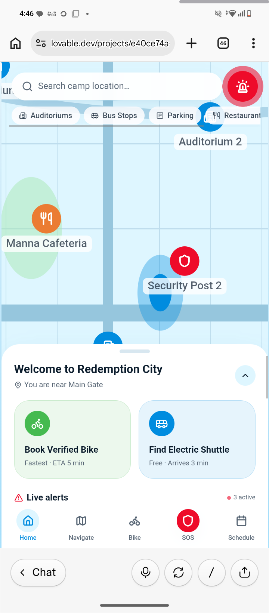
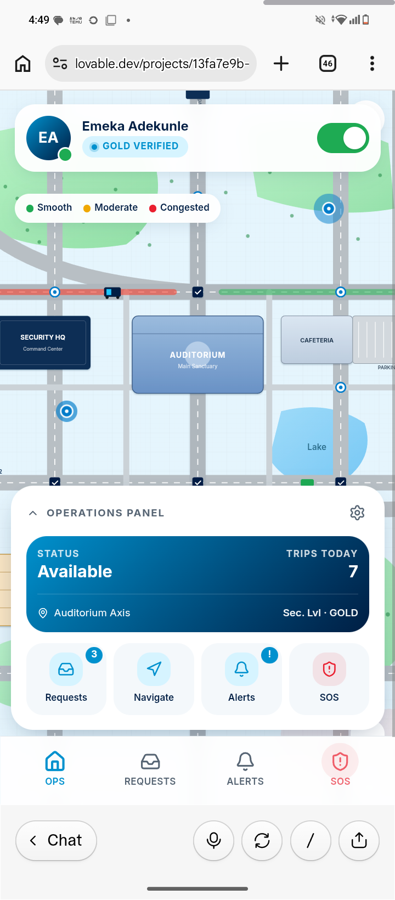
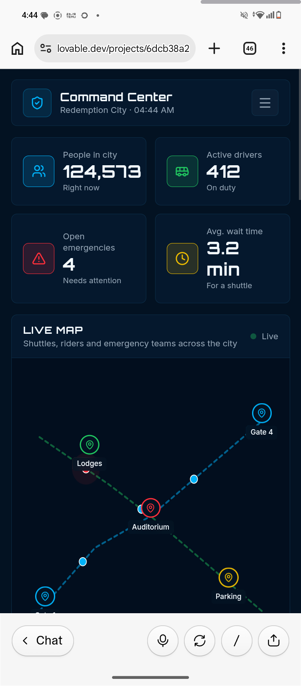

# Smart-mobility-and-Security-System-
Smart Mobility & Security System – Redemption City

Project Overview

The Smart Mobility & Security System is an integrated digital platform designed to improve transportation, navigation, and emergency response within Redemption City. The solution connects pilgrims, drivers, security personnel, and camp administrators through a unified ecosystem that enables seamless movement, real-time coordination, and enhanced safety during large gatherings and events.

Problem Statement

Redemption City hosts millions of visitors during conventions, congresses, and other large events. As attendance increases, visitors often experience transportation difficulties, traffic congestion, navigation challenges, and delays in accessing emergency assistance. Security teams and transport operators also face challenges coordinating activities efficiently across a large and densely populated environment. These issues can negatively affect visitor experience, operational efficiency, and overall safety.

Solution

The Smart Mobility & Security System addresses these challenges through a unified platform that combines smart navigation, transportation management, and emergency response services. By connecting pilgrims, drivers, and security teams in real time, the platform improves mobility, reduces congestion, enhances situational awareness, and enables faster emergency response throughout Redemption City.

Applications & Features

RedeemWays – Pilgrim App

- Real-Time Navigation
- Transport Booking
- Route Guidance
- SOS Emergency Assistance
- Live Transport Tracking

RedeemDrive – Driver App

- Driver Verification
- Ride Management
- GPS Navigation
- Traffic Alerts
- Emergency Reporting

RedeemCommand – Command Dashboard

- Live Monitoring
- Driver Tracking
- Emergency Dispatch
- Traffic Management
- Incident Reporting
## Architecture Diagram

.jpg‎)
.jpg‎)

##RedeemWays – Pilgrim App

## RedeemDrive – Driver App

## RedeemCommand Dashboard

Team member 
- Joseph Increase
Team Coat
- Nevup
